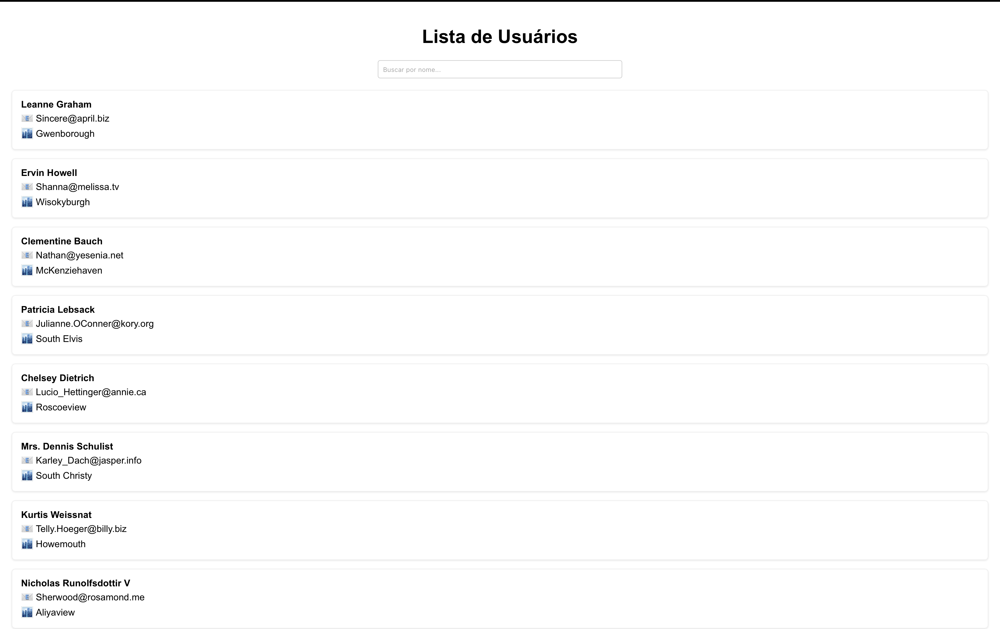

# 📋 Lista de Usuários com Busca e API

Projeto em React que consome uma API pública para exibir uma lista de usuários, com filtro em tempo real pelo nome. Desenvolvido como parte de estudos em frontend, consumo de APIs REST e para demonstrar habilidades em um processo seletivo.

## 🚀 Tecnologias

- React
- JavaScript (ES6+)
- HTML5 / CSS3
- Fetch API

## 🎨 Funcionalidades

✅ Lista usuários consumindo dados da [API JSONPlaceholder](https://jsonplaceholder.typicode.com/users)  
✅ Filtro em tempo real pelo nome do usuário  
✅ Layout simples, responsivo e agradável

## 📸 Captura de tela



## 📂 Como rodar localmente

Clone este repositório:
```bash
git clone https://github.com/T4T4V0/user-list-app.git
cd user-list-app
```

Instale as dependências:
```bash
npm install
```

Rode o projeto em ambiente de desenvolvimento:
```bash
npm start
```

Abra no navegador em [http://localhost:3000](http://localhost:3000)

## 🌐 Deploy

(Em breve) — este projeto pode ser publicado em plataformas como [Vercel](https://vercel.com) ou [Netlify](https://netlify.com) para ficar disponível online!

## 👨‍💻 Autor

[Gustavo Henrique Soares Feitosa](https://github.com/T4T4V0)
